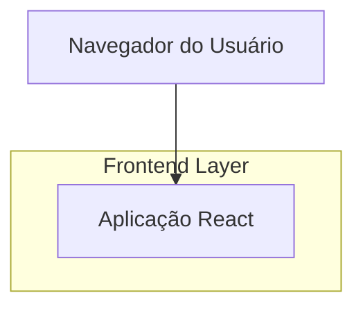
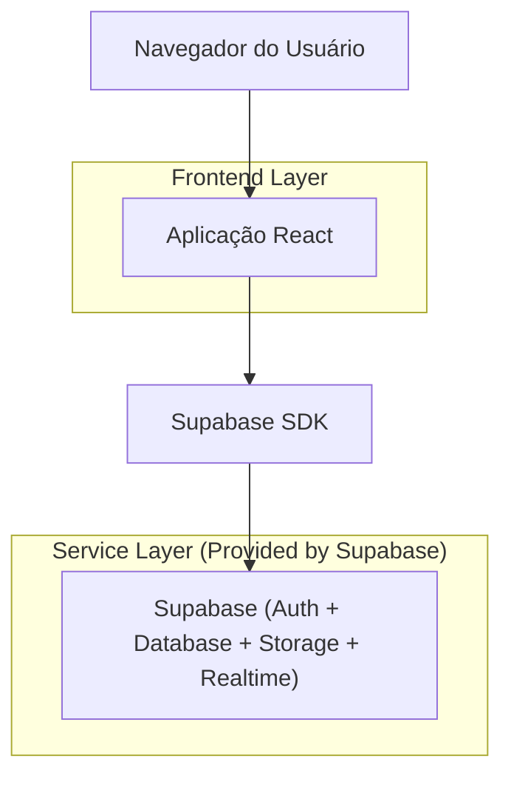
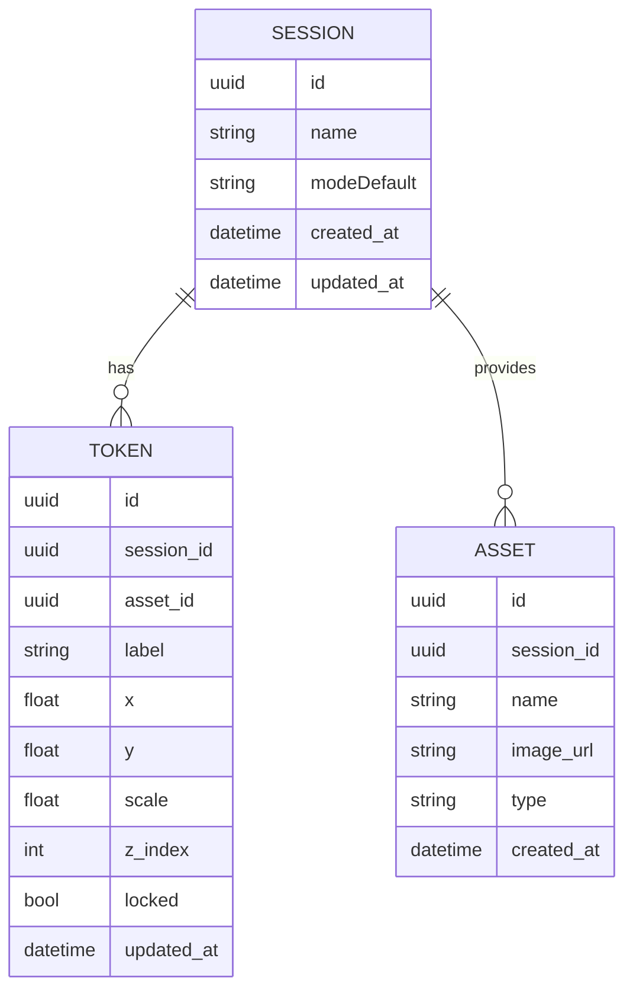

## 1.Architecture design

### Opção A (MVP local, sem colaboração)


### Opção B (estilo Roll20 com estado persistido e sincronização)


## 2.Technology Description
- Frontend: React@18 + TypeScript + vite + tailwindcss@3
- Backend (opcional): Supabase (PostgreSQL + Storage + Realtime + Auth)
- UI/Canvas (recomendado): react-konva (ou equivalente) para drag/zoom/pan e hit-testing de tokens

## 3.Route definitions
| Route | Purpose |
|-------|---------|
| /session/:sessionId | Página de sessão jogável (campo, assets, tokens, alternância Mestre/Jogador) |

## 6.Data model(if applicable)

### 6.1 Data model definition


### 6.2 Data Definition Language
Session (sessions)
```
CREATE TABLE sessions (
  id UUID PRIMARY KEY DEFAULT gen_random_uuid(),
  name TEXT NOT NULL,
  mode_default TEXT DEFAULT 'player',
  created_at TIMESTAMPTZ DEFAULT NOW(),
  updated_at TIMESTAMPTZ DEFAULT NOW()
);

CREATE TABLE assets (
  id UUID PRIMARY KEY DEFAULT gen_random_uuid(),
  session_id UUID NOT NULL,
  name TEXT NOT NULL,
  image_url TEXT NOT NULL,
  type TEXT DEFAULT 'character',
  created_at TIMESTAMPTZ DEFAULT NOW()
);

CREATE TABLE tokens (
  id UUID PRIMARY KEY DEFAULT gen_random_uuid(),
  session_id UUID NOT NULL,
  asset_id UUID,
  label TEXT,
  x DOUBLE PRECISION DEFAULT 0,
  y DOUBLE PRECISION DEFAULT 0,
  scale DOUBLE PRECISION DEFAULT 1,
  z_index INTEGER DEFAULT 0,
  locked BOOLEAN DEFAULT FALSE,
  updated_at TIMESTAMPTZ DEFAULT NOW()
);

CREATE INDEX idx_assets_session_id ON assets(session_id);
CREATE INDEX idx_tokens_session_id ON tokens(session_id);

-- permissões (guideline)
GRANT SELECT ON sessions TO anon;
GRANT SELECT ON assets TO anon;
GRANT SELECT ON tokens TO anon;

GRANT ALL PRIVILEGES ON sessions TO authenticated;
GRANT ALL PRIVILEGES ON assets TO authenticated;
GRANT ALL PRIVILEGES ON tokens TO authenticated;
```