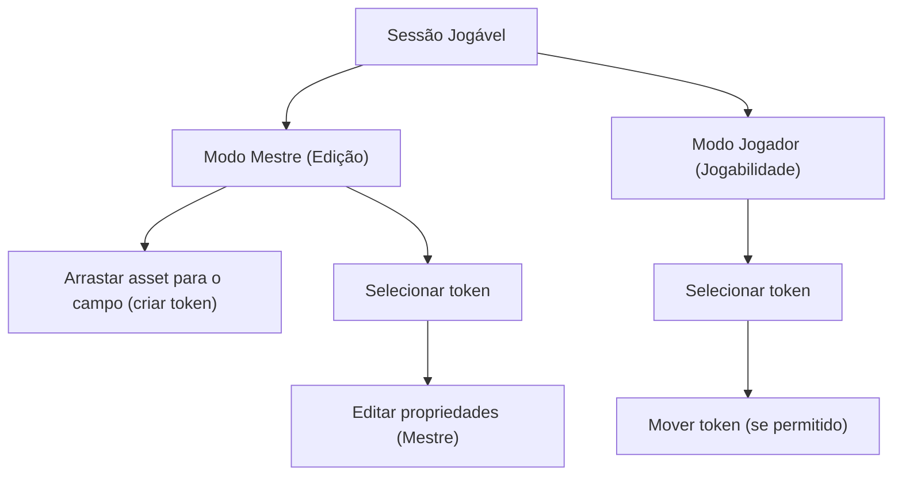

## 1. Product Overview
Página de sessão jogável estilo Roll20, com campo central para posicionar tokens e um modo Mestre com edição.
Você arrasta personagens (assets) de uma barra lateral para o campo, move/seleciona tokens e alterna entre “Mestre” e “Jogador”.

## 2. Core Features

### 2.1 User Roles
| Papel | Método de acesso | Permissões principais |
|------|-------------------|----------------------|
| Mestre | Acessa a sessão em “Modo Mestre” | Pode editar o campo (inserir/remover assets, ajustar propriedades, organizar a cena) |
| Jogador | Acessa a sessão em “Modo Jogador” | Pode interagir com tokens permitidos (selecionar/mover/visualizar) sem alterar a composição base |

### 2.2 Feature Module
Nossa necessidade consiste em:
1. **Página de Sessão Jogável**: alternância Mestre/Jogador, campo jogável (mapa/cena), barra de assets com personagens arrastáveis, seleção e movimentação de tokens, painel de propriedades no modo Mestre.

### 2.3 Page Details
| Page Name | Module Name | Feature description |
|-----------|-------------|------------------|
| Sessão Jogável | Cabeçalho da sessão | Exibir nome/identificador da sessão e status de modo atual; alternar entre “Modo Mestre” e “Modo Jogador”. |
| Sessão Jogável | Campo jogável (cena) | Renderizar área central para posicionar tokens; permitir pan/zoom; opcionalmente exibir grade para orientar posicionamento. |
| Sessão Jogável | Assets (barra lateral) | Listar personagens disponíveis como cards/miniaturas; permitir arrastar um personagem para o campo para criar um token. |
| Sessão Jogável | Tokens (interação) | Selecionar token; arrastar para mover; manter token dentro dos limites do campo; indicar estado selecionado/hover. |
| Sessão Jogável | Propriedades do token (apenas Mestre) | Exibir/editar propriedades essenciais do token selecionado (nome/label, imagem/miniatura, tamanho/escala, remover do campo). |
| Sessão Jogável | Permissões por modo | Restringir ações de edição (criar/remover/editar propriedades) ao Mestre; garantir que o Jogador não altere a composição base da cena. |

## 3. Core Process
**Fluxo Mestre (edição):** você entra na sessão, alterna/permanece em “Modo Mestre”, arrasta personagens da barra de assets para o campo criando tokens, posiciona/ajusta tokens no mapa e edita propriedades do token selecionado.

**Fluxo Jogador (jogabilidade):** você entra na sessão em “Modo Jogador”, visualiza a cena, seleciona e move (quando permitido) os tokens para interação durante o jogo.

